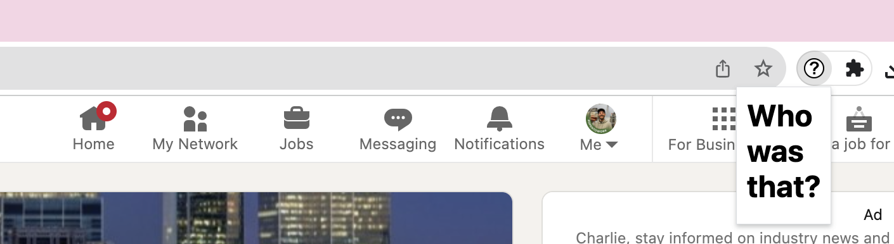

# Who was that?
A simple Chrome extension to add on to LinkedIn  
Solves an issue of when you meet someone, connect with them on LinkedIn, then when they accept your request you've already forgotten how you knew them. 
Or 3 years down the line looking through your connections you have no idea who any of these people were you met 
It works by when you add a new connection, an extra field pops up to allow you to leave a note  
### Click to see in action
{style="display: block; margin: 0 auto"}
### Click to see in action
{style="display: block; margin: 0 auto"}

